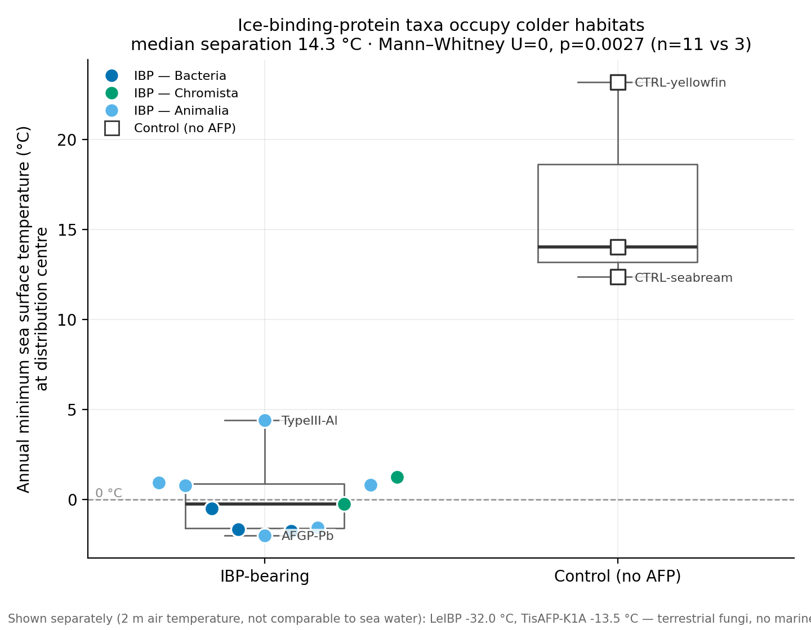
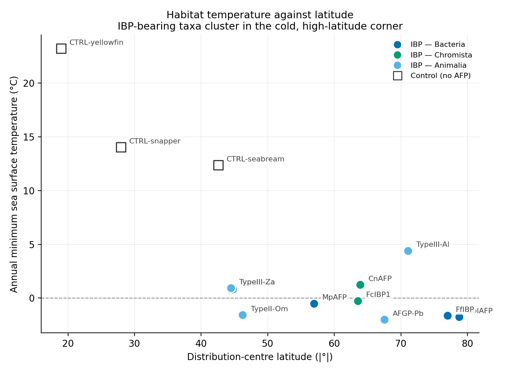
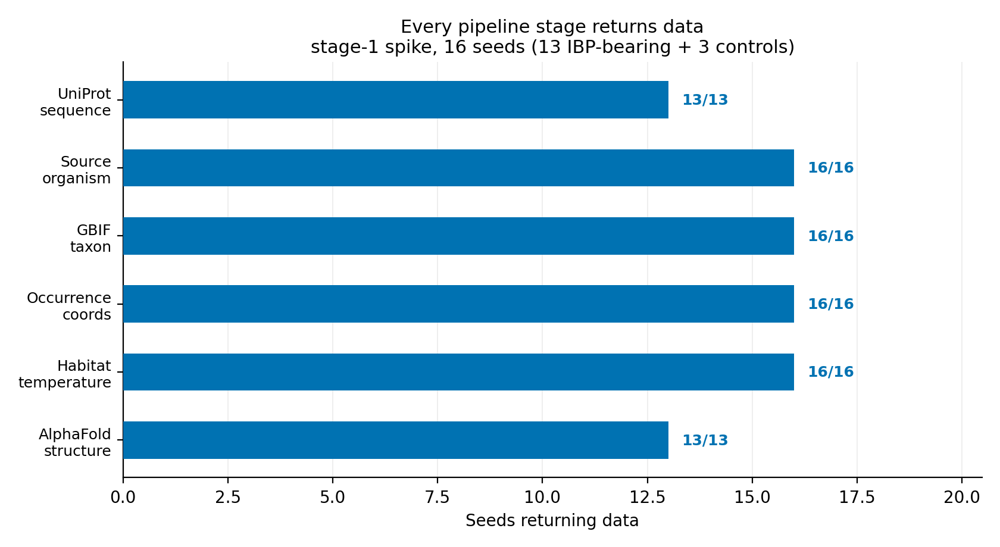
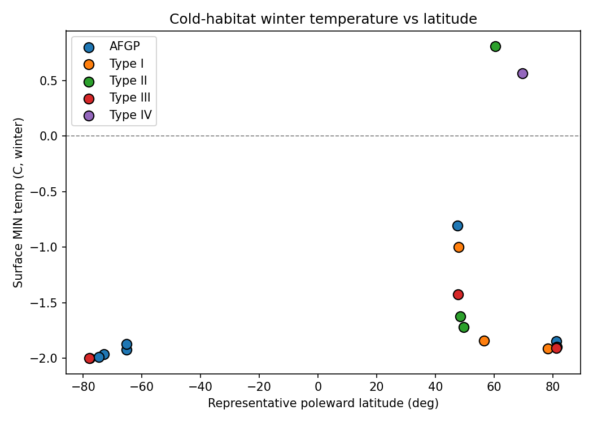
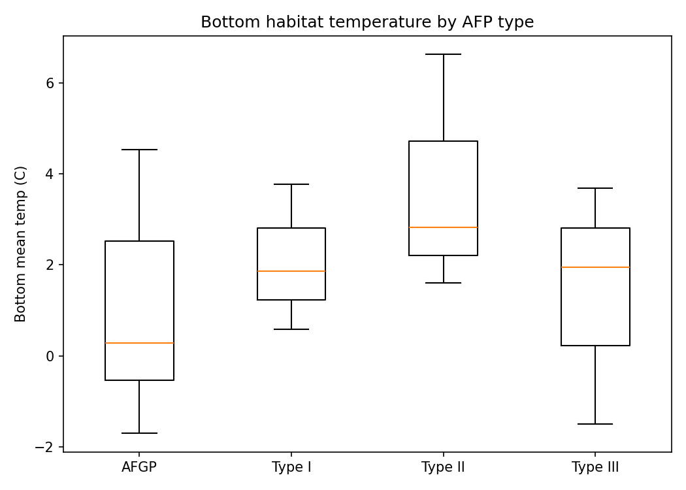
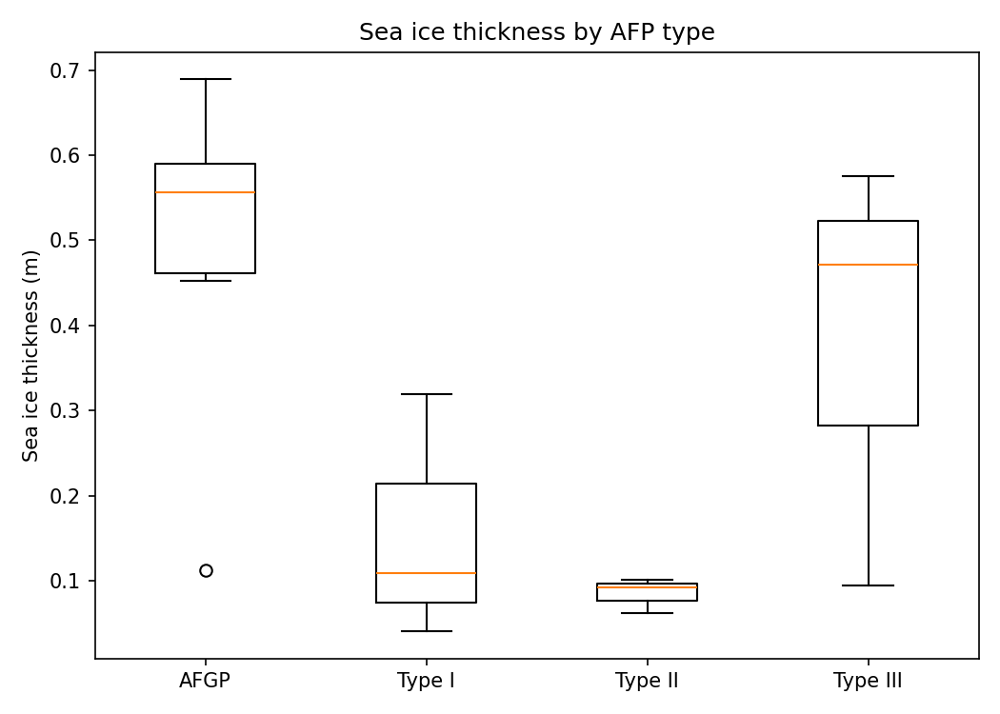
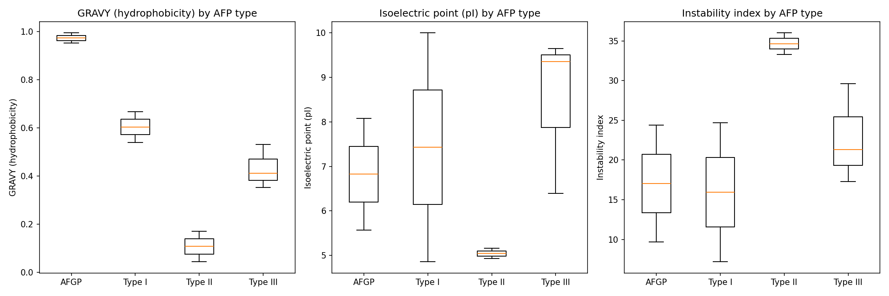
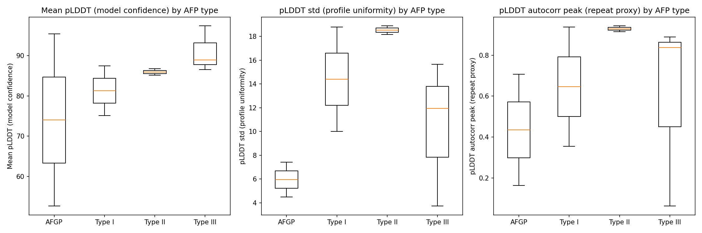
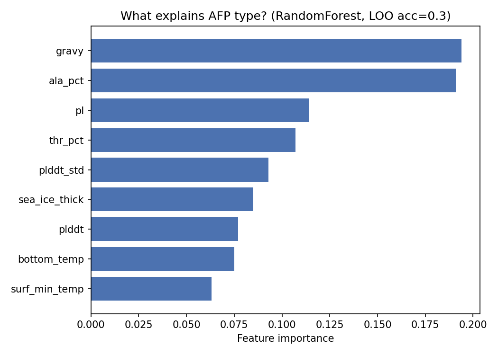
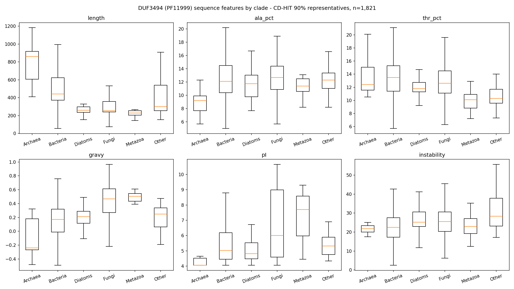

# 보고서용 자료 모음 (Report Assets)

`python -m src.build_report_assets` 로 생성됨. 모든 표는 `data/` 의 CSV 에서 직접 계산되므로 수치가 어긋나지 않음.

## 그림

모든 그림은 `figures/` 에 200 dpi PNG 로 저장됨. 색상은 Okabe-Ito 색각이상 안전 팔레트를 사용함.

### 그림 1. 1단계 스파이크 — IBP 보유 분류군 vs 음성 대조군의 서식지 수온

*IBP 보유군과 AFP 미보유 대조군(열대·온대 어류)의 연중최저 해수면온도. 채움 원은 IBP 보유군(계통별 색), 빈 사각형은 대조군. 육상 균류 2종은 측정량이 다른 대기 기온이므로 이 패널에서 빼고 하단에 값을 별도 표기함.*

### 그림 2. 1단계 스파이크 — 위도-수온 공간에서의 분리

*분포중심 위도와 연중최저 수온. IBP 보유군은 고위도·저온 영역에, 대조군은 저위도·고온 영역에 뚜렷이 분리됨.*

### 그림 3. 1단계 스파이크 — 파이프라인 단계별 데이터 반환율

*16개 시드가 각 단계에서 데이터를 반환한 비율. **전 단계 결손 없음** — 해양 분류군은 Bio-ORACLE, 육상 분류군은 Open-Meteo(ERA5)로 온도를 확보함.*

### 그림 4. 어류 AFP 18종 — 위도 대비 서식지 수온

*AFP 타입별 색 구분. 대표점은 분포중심, 수온은 Bio-ORACLE 연중최저값.*

### 그림 5. 어류 AFP 18종 — AFP 타입별 저층 수온

*Kruskal-Wallis H=4.96, p=0.292 (비유의).*

### 그림 6. 어류 AFP 18종 — AFP 타입별 해빙 두께

*환경 변수 중 유일하게 유의한 차이. Kruskal-Wallis H=10.99, p=0.027.*

### 그림 7. 어류 AFP 18종 — AFP 타입별 서열 물리화학 특성

*GRAVY, 등전점(pI), 불안정성 지수. GRAVY는 당쇄화를 반영하지 못하므로 AFGP 판정 근거로 쓰면 안 됨(README 참조).*

### 그림 8. 어류 AFP 18종 — AlphaFold pLDDT 기반 구조 지표

*plddt_std / plddt_periodicity 는 검증된 구조생물학 지표가 아닌 예비 휴리스틱임.*

### 그림 9. 어류 AFP 18종 — RandomForest 변수 중요도 (LOO-CV)

*표본이 작아 정확도 자체는 참고치이며, 변수 중요도 확인 목적.*

### 그림 10. 2단계 DUF3494 — 계통별 서열 특성 (CD-HIT 90% 대표 1,835개)

*전 변수가 계통 간 유의차를 보임(전부 p<1e-5). 단 length 는 도메인 길이가 아니라 단백질 전체 길이이므로 해석 주의(README 참조).*

## 표 1. 1단계 스파이크 — 시드 16종 전 단계 결과

| 라벨 | UniProt | 출처 생물 | 계통 | AFP 계열 | GBIF 해상도 | 출현기록 | 분포중심 |위도| | 연중최저 수온(°C) | AlphaFold | pLDDT | 육상 최저기온(°C) |
|---|---|---|---|---|---|---|---|---|---|---|---|
| ColAFP | A5XB26 | Colwellia sp | Bacteria | DUF3494 | GENUS | 300 | 78.75 | -1.74 | True | 91.75 | — |
| FfIBP | H7FWB6 | Flavobacterium frigoris (strain PS1) | Bacteria | DUF3494 | SPECIES | 71 | 77.00 | -1.64 | True | 86.75 | — |
| MpAFP | A1YIY2 | Marinomonas primoryensis | Bacteria | RTX-adhesin | SPECIES | 8 | 56.94 | -0.50 | True | 84.06 | — |
| LeIBP | C7F6X3 | Leucosporidium sp. (strain AY30) | Fungi | DUF3494 | GENUS | 300 | 61.08 | — | True | 91.38 | -31.96 |
| TisAFP-K1A | Q76CE8 | Typhula ishikariensis | Fungi | DUF3494 | SPECIES | 98 | 47.84 | — | True | 95.00 | -13.48 |
| FcIBP1 | D0FHA3 | Fragilariopsis cylindrus | Chromista | DUF3494 | SPECIES | 300 | 63.52 | -0.25 | True | 86.94 | — |
| CnAFP | D2DLE1 | Chaetoceros neogracilis | Chromista | DUF3494 | SPECIES | 300 | 63.87 | 1.25 | True | 84.50 | — |
| AFGP-Pb | P02732 | Pagothenia borchgrevinki | Animalia | AFGP | SPECIES | 300 | 67.51 | -1.99 | True | 95.38 | — |
| TypeI-Pa | P04002 | Pseudopleuronectes americanus | Animalia | Type I | SPECIES | 300 | 44.47 | 0.78 | True | 75.12 | — |
| TypeII-Ha | P05140 | Hemitripterus americanus | Animalia | Type II | SPECIES | 300 | 44.76 | 0.83 | True | 85.12 | — |
| TypeII-Om | Q01758 | Osmerus mordax | Animalia | Type II | SPECIES | 300 | 46.23 | -1.55 | True | 86.75 | — |
| TypeIII-Za | P07457 | Zoarces americanus | Animalia | Type III | SPECIES | 300 | 44.46 | 0.94 | True | 86.56 | — |
| TypeIII-Al | P12416 | Anarhichas lupus | Animalia | Type III | SPECIES | 300 | 71.09 | 4.41 | True | 88.94 | — |
| CTRL-yellowfin | — | Thunnus albacares | Animalia | none | SPECIES | 300 | 18.96 | 23.20 | — | — | — |
| CTRL-seabream | — | Sparus aurata | Animalia | none | SPECIES | 300 | 42.58 | 12.38 | — | — | — |
| CTRL-snapper | — | Lutjanus campechanus | Animalia | none | SPECIES | 300 | 27.95 | 14.04 | — | — | — |

시드 16개 = IBP 보유 13 + 음성 대조군 3. 해양 수온 14건, 육상 기온 2건.

## 표 2. 한랭 적응 검증 (해양 분류군)

| 그룹 | n | 중앙값(°C) | 최소 | 최대 |
|---|---|---|---|---|
| IBP 보유 | 11 | -0.25 | -1.99 | 4.41 |
| 대조군 (AFP 없음) | 3 | 14.04 | 12.38 | 23.20 |

**중앙값 차이 14.30 °C · Mann-Whitney U=0, p=0.0027** (단측). U=0 은 두 그룹이 순위상 완전히 분리됨을 뜻함.

## 표 3. 2단계 DUF3494(PF11999) 계통 구성

| 계통 | 대표서열 수 | 비율(%) | 고유 분류군 |
|---|---|---|---|
| Bacteria | 1284 | 70.0 | 932 |
| Fungi | 412 | 22.5 | 154 |
| Other | 47 | 2.6 | 6 |
| Diatoms | 46 | 2.5 | 5 |
| Metazoa | 17 | 0.9 | 4 |
| Archaea | 15 | 0.8 | 13 |
| Plants | 14 | 0.8 | 3 |

UniProtKB 2,250건 → CD-HIT 90% → **1,835개 대표서열 / 1,117 분류군**. Swiss-Prot 리뷰 항목은 9건뿐임.

### 계통별 서열 특성 중앙값

| 계통 | 길이(aa) | ala_pct | thr_pct | gravy | pI | instability |
|---|---|---|---|---|---|---|
| Archaea | 861.00 | 9.20 | 12.40 | -0.24 | 4.05 | 21.80 |
| Bacteria | 441.00 | 12.10 | 13.50 | 0.17 | 5.01 | 22.50 |
| Diatoms | 258.00 | 11.75 | 11.80 | 0.21 | 4.80 | 25.15 |
| Fungi | 253.50 | 12.70 | 12.60 | 0.47 | 6.00 | 25.55 |
| Metazoa | 229.00 | 11.40 | 10.10 | 0.50 | 7.70 | 22.90 |
| Other | 301.00 | 12.30 | 10.30 | 0.25 | 5.32 | 28.30 |

## 표 4. DUF3494 속(genus) 단위 서식지 온도 — 부분 결과

⚠️ **진행 중인 배치의 중간 결과 (9 / 441 속)**. 완주에는 수 시간이 더 필요하며, `python -m src.expand_env` 를 다시 실행하면 이어서 진행됨.

| 속 | 계통 | 분포중심 |위도| | 서식 구분 | 육상 최저(°C) | 단백질 수 |
|---|---|---|---|---|---|
| Streptomyces | Bacteria | 27.30 | terrestrial | -6.267 | 141 |
| Flavobacterium | Bacteria | 43.25 | terrestrial | -0.467 | 105 |
| Mycena | Fungi | 39.34 | terrestrial | 0.967 | 94 |
| Pontibacter | Bacteria | 23.52 | terrestrial | 6.467 | 59 |
| Fragilariopsis | Diatoms | 62.86 | 1.229 | marine | 43 |
| Polarella | Other | 79.68 | -1.994 | marine | 40 |
| Micromonospora | Bacteria | 7.15 | terrestrial | 19.4 | 40 |
| Streptosporangium | Bacteria | 31.97 | terrestrial | 1.4 | 34 |
| Cryobacterium | Bacteria | 40.78 | terrestrial | -16.833 | 34 |

서식 구분: {'terrestrial': 7, '1.229': 1, '-1.994': 1}. 판정은 정확 격자 셀(반경 0) 기준이며, 근접 셀 탐색을 쓰면 토양 세균이 해양으로 오분류됨(README 참조).

## 표 5. 어류 AFP 18종 — 그룹 비교 통계

| 변수 | Kruskal-Wallis H | p | 구분 | 그룹 수 | n |
|---|---|---|---|---|---|
| surf_min_temp | 6.6800 | 0.1535 | environment | 5 | 18 |
| bottom_temp | 4.9600 | 0.2917 | environment | 5 | 18 |
| sea_ice_thick | 10.9900 | 0.0266 | environment | 5 | 18 |
| ala_pct | 8.0000 | 0.0916 | sequence | 5 | 10 |
| thr_pct | 5.7600 | 0.2175 | sequence | 5 | 10 |
| gravy | 8.6200 | 0.0714 | sequence | 5 | 10 |
| pI | 4.7300 | 0.3164 | sequence | 5 | 10 |
| instability | 6.1500 | 0.1885 | sequence | 5 | 10 |
| plddt | 3.0400 | 0.5518 | structure | 5 | 10 |
| plddt_std